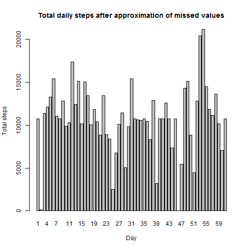

## Loading and preprocessing the data

```r
ds <- read.csv("activity.csv")
```

## What is mean total number of steps taken per day?
Calculate total number of steps taken per day


```r
ds_steps <- aggregate(steps ~ date, data = ds, FUN = sum, na.action = na.pass)
with (ds_steps, 
      barplot(height = steps, width = 1, names = labels(date), 
              ylab = "Total steps", xlab = "Day",main = "Total daily steps"
              )
      )
```

 

```r
meansteps <- mean(ds_steps$steps, na.rm = TRUE)
mediansteps <- median(ds_steps$steps, na.rm = TRUE)
sdsteps <- sd(ds_steps$steps, na.rm = TRUE)
```

Mean total number of steps per day is 10766

Median total number of steps per day is 10765

Std. deviation of the total number of steps per day is 4269

## What is the average daily activity pattern?

```r
ds_avg_steps <- aggregate(steps ~ interval, data = ds, FUN = mean)
with (ds_avg_steps, 
      plot(x = interval/100, y = steps, type = "l", 
           ylab = "Avg. steps", xlab = "interval(hour)", main="Average daily activity pattern"
           )
      )
```

 

```r
maxavgint <- ds_avg_steps$interval[which.max(ds_avg_steps$steps)]
maxavgintstr <- paste0(trunc(maxavgint/100), "h ", maxavgint - trunc(maxavgint/100)*100, "min")
```
5-minutes interval containing maximum number of steps in average begins at 8h 35min 

## Imputing missing values

Total number of rows with NA is 2304

Approximate NA values with mean values for the corresponding intervals

```r
#calculate mean values per interval
ds_mean_int <- aggregate(steps ~ interval, data = ds, FUN = mean)
#find rows with NAs
cc <- which(!complete.cases(ds))
#replace NAs with the corresponding mean value
ds$steps[cc] <- sapply(cc, FUN = function(i) 
    ds_mean_int$steps[which(ds_mean_int$interval == ds$interval[i])])
#draw barplot to see the picture
ds_steps <- aggregate(steps ~ date, data = ds, FUN = sum)
with (ds_steps, 
      barplot(height = steps, width = 1, names = labels(date), 
              ylab = "Total steps", xlab = "Day",
              main="Total daily steps after approximation of missed values"
              )
      )
```

 

```r
meansteps <- mean(ds_steps$steps)
mediansteps <- median(ds_steps$steps)
sdsteps <- sd(ds_steps$steps, na.rm = TRUE)
```

Mean total number of steps per day is 10766

Median total number of steps per day is 10766

Std. deviation of the total number of steps per day is 3974

Compared to the original dataset, the mean and median values remained practically the same, whereas standard deviation changed, i.e. decreased, which shows that the modified dataset is less spread around its center.


```r
library(ggplot2)
#create factor for week days (0-Sunday, 1-Monday,..., 6-Saturday)
wds <- factor(c("weekend","weekday","weekday","weekday","weekday","weekday","weekend"),
              levels=c("weekend","weekday"))

#calcaulate weekday from 1 to 7
ds$wd <- wds[as.POSIXlt(ds$date)$wday+1]

#draw plot for the average number of steps per interval in weekdays and weekends
ds_wd_steps <- aggregate(steps ~ interval + wd, data = ds, FUN = mean)

qplot(y = steps, x = interval/100, data = ds_wd_steps, 
      geom = "path", xlab = "interval(hour)", ylab = "Number of steps",
      main = "Average number of steps per interval in weekdays and weekends"
      ) + facet_wrap(~ wd, nrow = 2) + geom_path(colour = 'blue', size = 0) 
```

 
